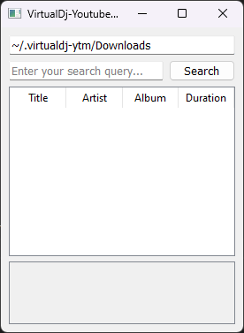
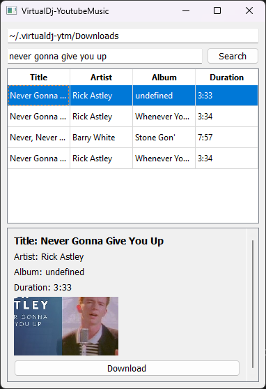

# Virtualdj-ytm (Virtual DJ - Youtube Music)

<a href="https://buymeacoffee.com/champagnearden" target="_blank"></a>

[](https://github.com/champagnearden/virtualdj-ytm "Go to GitHub repo")
[](https://github.com/champagnearden/virtualdj-ytm)
[](https://github.com/champagnearden/virtualdj-ytm)
[](https://github.com/champagnearden/virtualdj-ytm/issues)

<details open>
  <summary>Content Table</summary>

   1. [Main objective](#1-main-objective)
   2. [Prerequisities](#2-prerequisities)
   3. [Dev note](#3-dev-note)
   4. <details open><summary><a href="#4-how-to-install">How to install</a></summary>

      1. [Python](#41-python)
      2. [C++](#42-c)
      </details>
   5. <details open><summary><a href="#5-how-to-use">How tu use</summary>

      1. [UI](#51-ui)
      2. [CLI](#52-cli)
      </details>
   6. [Future](#6-future)
</details>

## 1. Main objective

The main goal of virtualdj-ytm is to make possible the action to search song on youtube directly with youtube music results, download the song in `.m4a` format and then make it available for your mix !

You'll be able to download song using youtube music research and select your destination directory (GUI only)

## 2. Prerequisities

Make sure to have [ffmpeg](https://www.ffmpeg.org/download.html "Download ffmpeg") installed:

1. ```bash
   ffmpeg -version
   ```
2. Install the dependencies using the [vcpkg](https://vcpkg.io/en/ "vcpkg home page") install command:
   ```bash
   vcpkg install
   ```
3. Install [python](https://www.python.org/downloads/ "Download python") package:
   1. Check if you have python installed with:

      ```bash
      python --version
      ```
   2. Check if you have `pip` installed and up to date:

      ```bash
      pip --version && pip install --upgrade pip
      ```
   3. Install the package `yt-dlp`:

      ```bash
      pip install yt-dlp
      ```

## 3. Dev note

I recommand using the python tool, more maintained and has a UI.
If any bug occurs, I'll fix it quicker in the python version.

C++ version exist because I'd like to implement it as a plugin in the [VirtualDJ](https://www.virtualdj.com/download/) software.

## 4. How to install

### 1. Python

You have the choice to use the CLI version or the GUI version.
Please navigate to the python subfolder:
```bash
cd python
```

Make sure to download all the dependencies nedded:
```bash
pip install -r requirements.txt
```

- Launch CLI version:
```bash
python ./index.py
```

- Launch GUI version:
```bash
python ./launch_ui.py
```

### 2. C++

I'm not used to c++ development and install but here are the commands that should work (feel free to edit) 

1. Navigate to the vcpkg directory:
```bash
cd vcpkg
```

2. Bootstrap vcpkg:
```bash
./bootstrap-vcpkg.sh
```

3. Install the required packages:
```bash
./vcpkg install cpr nlohmann-json
```

4. Build the Project with CMake:
Create a build directory:
```bash
mkdir build
cd build
```

5. Configure the project with CMake, specifying the vcpkg toolchain file:
```bash
cmake .. -DCMAKE_TOOLCHAIN_FILE=../vcpkg/scripts/buildsystems/vcpkg.cmake
```

6. Build the project:
```bash
cmake --build .
```

7. Run the Plugin:
After a successful build, execute the plugin:
```bash
./virtualdj-ytm
```

## 5. How to use

Each time you run the python program (CLI or UI), actions will be logged into `vdj.log` using the following format:
`${timestamp}: [${LEVEL}] ${message}`

### UI

When launched, the script `launch_ui.py` should open a python window like this:



You can:
- Edit the download folder in the first field
- Search a song

To search a song, enter your query in the second field and hit "Search".
You can make spelling mistake, big brother will correct you.

Then, the list of songs will be updated:



Now select any row and see the details underneath the search results.
You can now hit the download button and let the magic happen !

*Yes, the popup will disappear by itself but you can click on "Ignore"*

### CLI

Follow the instructions in console

## 6. Future

Features I'd like to implement:

* Use your google account to get personnalized results
* Stream musics without downloading them (warning ads for non-premium users)
* Choose destination directory
